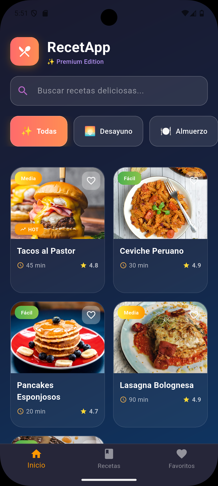
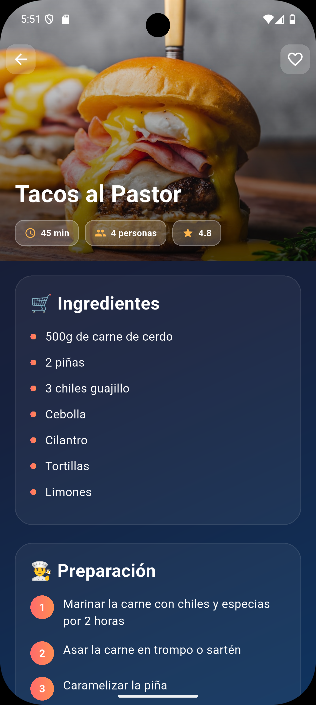
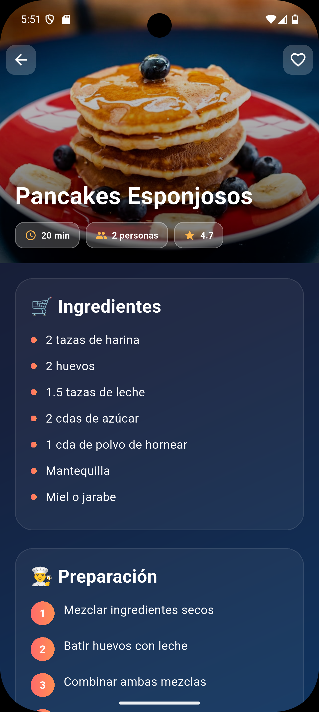
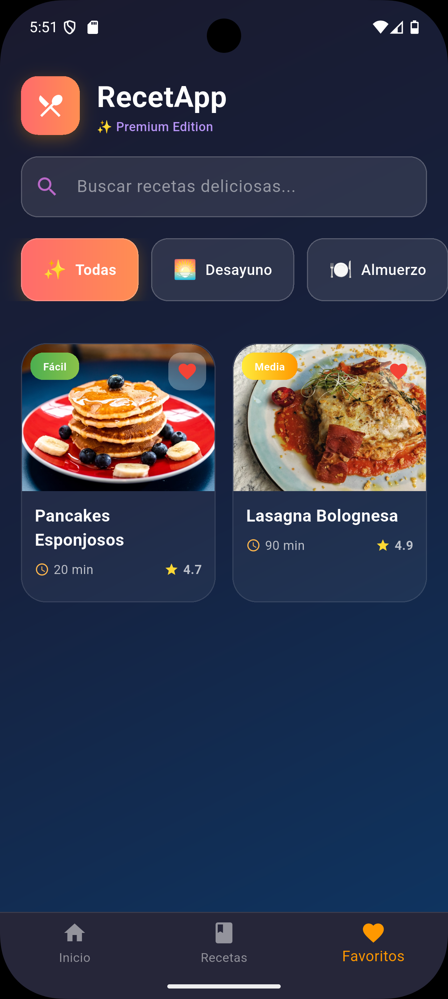
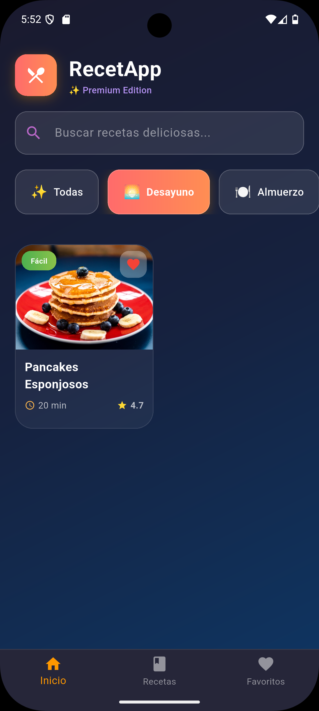

# 🍽️ RecetApp - Premium Recipe App

[](https://flutter.dev/)
[](https://dart.dev/)
[](LICENSE)
[](https://flutter.dev/)

> Una elegante aplicación de recetas desarrollada en Flutter con un diseño moderno y animaciones fluidas.

## ✨ Características Principales

- 🎨 **Diseño Premium**: Interfaz moderna con gradientes y efectos visuales
- 🔍 **Búsqueda Inteligente**: Encuentra recetas por nombre en tiempo real
- 🏷️ **Categorías Dinámicas**: Filtra por desayuno, almuerzo, cena y postres
- ❤️ **Favoritos**: Sistema de favoritos con persistencia local
- 📱 **Responsivo**: Diseño adaptativo para diferentes tamaños de pantalla
- 🎭 **Animaciones**: Transiciones Hero y animaciones de fade suaves
- 🌟 **Trending**: Indicadores visuales para recetas populares
- ⭐ **Rating**: Sistema de calificaciones por estrellas
- 🏷️ **Dificultad**: Indicadores de nivel de dificultad con colores
- 🔢 **Información Completa**: Tiempo de preparación, porciones y calorías

## 📱 Capturas de Pantalla

<div align="center">
  <table>
    <tr>
      <td align="center">
        
        <br/>
        <b>Pantalla Principal</b>
      </td>
      <td align="center">
        
        <br/>
        <b>Función de Búsqueda</b>
      </td>
      <td align="center">
        
        <br/>
        <b>Filtros por Categorías</b>
      </td>
    </tr>
    <tr>
      <td align="center">
        
        <br/>
        <b>Vista Detallada</b>
      </td>
      <td align="center">
        
        <br/>
        <b>Recetas Favoritas</b>
      </td>
      <td align="center">
        <!-- Espacio para futuras capturas -->
      </td>
    </tr>
  </table>
</div>

## 🏗️ Arquitectura del Proyecto

```
lib/
├── main.dart                    # Punto de entrada de la aplicación
└── src/
    ├── models/
    │   └── recipes_model.dart   # Modelo de datos para recetas
    ├── pages/
    │   ├── home_page.dart       # Página principal con grid de recetas
    │   └── recipe_details.dart  # Página de detalles de receta
    └── utils/
        └── recipe_list.dart     # Lista estática de recetas de ejemplo
```

## 🛠️ Tecnologías y Características Técnicas

### Framework y Herramientas
- **Flutter**: 3.9.0+ - Framework multiplataforma
- **Dart**: 3.0+ - Lenguaje de programación
- **Material Design**: Componentes UI modernos

### Características de Desarrollo
- **Arquitectura MVC**: Separación clara entre modelo, vista y lógica
- **State Management**: Manejo de estado con StatefulWidget
- **Hero Animations**: Transiciones suaves entre pantallas
- **Custom Widgets**: Componentes reutilizables y modulares
- **Responsive Design**: Adaptación automática a diferentes pantallas

### Diseño Visual
- **Gradientes**: Efectos visuales premium con múltiples gradientes
- **Glassmorphism**: Efectos de vidrio con transparencias
- **Custom Theme**: Tema oscuro personalizado con paleta de colores coherente
- **Typography**: Fuente Poppins para una mejor legibilidad
- **Shadows & Borders**: Efectos de profundidad y bordes redondeados

## 🚀 Instalación y Configuración

### Prerrequisitos
- Flutter SDK (3.9.0 o superior)
- Dart SDK (3.0 o superior)
- Android Studio / VS Code
- Git

### Pasos de Instalación

1. **Clona el repositorio**
   ```bash
   git clone https://github.com/GianSandoval5/recetas_app_2025.git
   cd recetas_app
   ```

2. **Instala las dependencias**
   ```bash
   flutter pub get
   ```

3. **Verifica la configuración de Flutter**
   ```bash
   flutter doctor
   ```

4. **Ejecuta la aplicación**
   ```bash
   # Para desarrollo
   flutter run
   
   # Para producción
   flutter run --release
   ```

## 📦 Dependencias Principales

```yaml
dependencies:
  flutter:
    sdk: flutter
  cupertino_icons: ^1.0.8

dev_dependencies:
  flutter_test:
    sdk: flutter
  flutter_lints: ^5.0.0
```

## 🎯 Funcionalidades Implementadas

### Pantalla Principal (HomePage)
- ✅ Grid responsivo de recetas con diseño de tarjetas
- ✅ Barra de búsqueda en tiempo real
- ✅ Filtros por categorías (Desayuno, Almuerzo, Cena, Postres)
- ✅ Sistema de favoritos con toggle visual
- ✅ Indicadores de tendencias y popularidad
- ✅ Navegación inferior con 3 pestañas
- ✅ Animaciones de fade y transiciones suaves

### Vista de Detalles (RecipeDetailPage)
- ✅ Header expandible con imagen Hero
- ✅ Información completa de la receta
- ✅ Lista de ingredientes con bullets personalizados
- ✅ Pasos de preparación numerados
- ✅ Botón de favoritos integrado
- ✅ Diseño responsive con CustomScrollView

### Modelo de Datos
- ✅ Estructura completa de Recipe con todos los campos necesarios
- ✅ Propiedades para trending y featured
- ✅ Sistema de categorías flexible
- ✅ Información nutricional básica

## 🎨 Paleta de Colores

```dart
// Gradiente Principal
const primaryGradient = LinearGradient(
  colors: [Color(0xFFFF6B6B), Color(0xFFFF8E53)],
);

// Fondo de la Aplicación
const backgroundGradient = LinearGradient(
  colors: [Color(0xFF1a1a2e), Color(0xFF16213e), Color(0xFF0f3460)],
);

// Colores de Dificultad
const easyColors = [Colors.green, Colors.lightGreen];
const mediumColors = [Colors.yellow, Colors.orange];
const hardColors = [Colors.red, Colors.pink];
```

## 🔮 Futuras Mejoras

- [ ] **Backend Integration**: Conexión con API REST para recetas dinámicas
- [ ] **User Authentication**: Sistema de login y registro de usuarios
- [ ] **Recipe Creation**: Funcionalidad para crear recetas personalizadas
- [ ] **Social Features**: Compartir recetas y seguir otros usuarios
- [ ] **Offline Mode**: Caché local para uso sin internet
- [ ] **Shopping List**: Generar lista de compras desde ingredientes
- [ ] **Timer Integration**: Temporizadores para pasos de cocción
- [ ] **Nutrition Tracker**: Análisis nutricional detallado
- [ ] **Voice Commands**: Navegación por voz durante la cocina
- [ ] **AR Features**: Realidad aumentada para medidas y porciones

## 📱 Plataformas Soportadas

| Plataforma | Estado | Notas |
|-----------|--------|--------|
| Android | ✅ Completo | Versión mínima: API 21 |
| iOS | ✅ Completo | Versión mínima: iOS 12 |
| Web | ✅ Completo | Responsive design |
| Windows | ✅ Completo | Desktop app |
| macOS | ✅ Completo | Desktop app |
| Linux | ✅ Completo | Desktop app |

## 🤝 Contribución

Las contribuciones son bienvenidas. Para contribuir:

1. Fork el proyecto
2. Crea una nueva rama (`git checkout -b feature/nueva-funcionalidad`)
3. Commit tus cambios (`git commit -am 'Añadir nueva funcionalidad'`)
4. Push a la rama (`git push origin feature/nueva-funcionalidad`)
5. Abre un Pull Request

## 📄 Licencia

Este proyecto está bajo la Licencia MIT. Ver el archivo `LICENSE` para más detalles.

## 👨‍💻 Desarrollador

**Tu Nombre**
- GitHub: [GianSandoval5](https://github.com/GianSandoval5)
- LinkedIn: [Gian Sandoval](https://linkedin.com/in/giansandoval)
- Email: gsandoval@flupione.com - gsandoval@flutterpiura.com

---

<div align="center">
  <p>Desarrollado con CLAUDE ❤️ usando Flutter</p>
  <p>ES GRATIS PARA TODOS</p>
</div>
